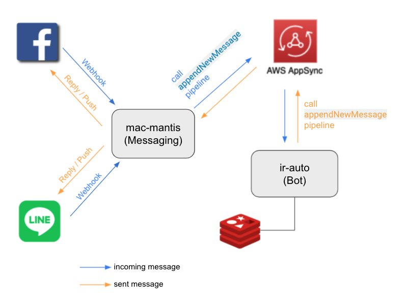

## Prerequisites

- Docker
- Node.js
- Yarn
- (optional) Nvm

## To start development

- Create `.env` file in root folder
- Make sure to switch to the correct node version (using `nvm` is recommended)

```sh
nvm use
```

- Install dependencies

```bash
$ yarn
```

- Start development server - (default exposed PORT of application is 5001)

```bash
$ docker compose up
```

- Create a tunnel (using [ngrok](https://ngrok.com))

```bash
$ ./ngrok http -region=ap $PORT
```

- change the resource of datasource to be your opening tunnel via [AWS Appsync console](https://console.aws.amazon.com/console/home)

## How it works



when user send messages to our channel in [LINE](https://line.me/en/) or [Messenger](https://www.messenger.com/) platform. They will forward those events via webhook url. The events are going to be directly through [mac-mantis (aka Messaging)](https://github.com/appman-agm/mac-mantis) service. It acts as an adaptor for transforming event data of every channels to be in the proper format used inside AOC. Then, the [Messaging](<(https://github.com/appman-agm/mac-mantis)>) call graphQL mutation `appendNewMessage` and the pipeline is executed (via [Appsync](https://aws.amazon.com/appsync/)) in order to save those messages into DynamoDB and send them to [IR-auto (aka bot)](https://github.com/appman-agm/ir-auto) as well
On the other hand, [Bot](https://github.com/appman-agm/ir-auto) uses the same way in order to respond messages to the users.

## Remarks

IR-auto utilize [XState library](https://xstate.js.org/) (state machine) for controlling the user flow.
Plus, with [Redis](https://redis.io/) for store the individual session of user

here is some example of application flow created by state machine :

- [AYCAL](https://xstate.js.org/viz/?gist=4b04985bf22eb9f3635161503c176c19)

## Code formatting and linting

we use `eslint` and `prettier` to ensure we have consistent code formats

it is ideal to always format your code with prettier

for vscode users, you can add this config to your local to have the editor help
`./.vscode/settings.json`

```
{
  "[javascript]": {
    "editor.defaultFormatter": "esbenp.prettier-vscode",
    "editor.formatOnSave": true
  },
  "[typescript]": {
    "editor.defaultFormatter": "esbenp.prettier-vscode",
    "editor.formatOnSave": true
  }
}
```
